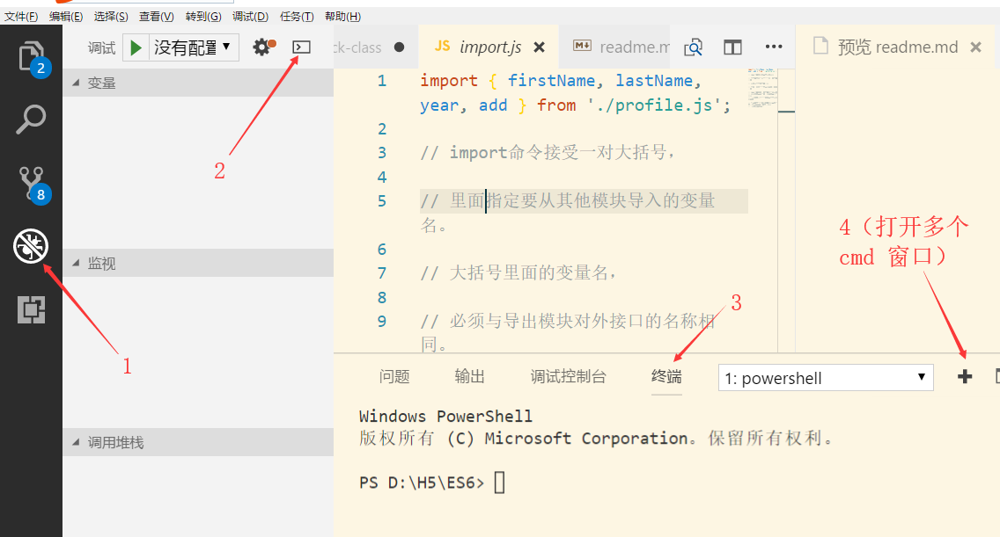

### IDE ？
> 代码编辑器（sublime、VSCode、webstorm、Hbuidler、Atom）
 

### `cmd`窗口？
>windows 操作系统为我们提供的命令行窗口
>我们操作电脑一般用鼠标和键盘
>我们完全可以在 `cmd`窗口操作电脑，在`cmd`窗口操作电脑可以实现和鼠标键盘同样的功能

#### 如何打开计算机的cmd窗口？
 
 >`windows + R`  在弹出的窗口当中输入 `cmd`命令，
 然后回车确定
 
 >`powershell`窗口 本质上就是 `cmd` 窗口

>vscode 里面集成了 `cmd` 窗口

>vscode可以打开多个 `cmd`  窗口



### cmd窗口常用命令？

* `cd 空格 文件夹名称`  （进入某个文件夹）
* `ls`  （列出所有文件夹下面的文件）
* `cd  空格 .. ` （跳出某个文件夹）
* `调出上一次命令`  : 上箭头
* `调出下一次命令 `：下箭头

### node
---
```
是一个ES5/ES6 的一个运行平台（软件）

node 作用？
解析ES5、ES6编写的服务器程序
```
### 浏览器 
---
```
  是一个ES5/ES6 的一个运行平台（软件）
  浏览器作用？
  远程拉取服务器上面的网页，并解析，呈现给用户 
```

 #### node 和 浏览器的相同点
```
  1、都是运行在操作系统（windows\linux）上面的软件
  2、能够解析用ES5、ES6写的程序
```
 #### node 和 浏览器的不同点
 ```
 1、浏览器是解析的网页程序
    node解析的是服务器程序
 ```


### node 安装？
>官网下载安装
