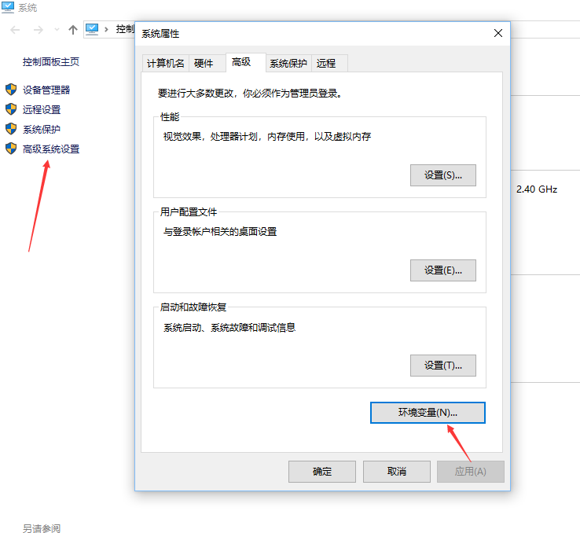
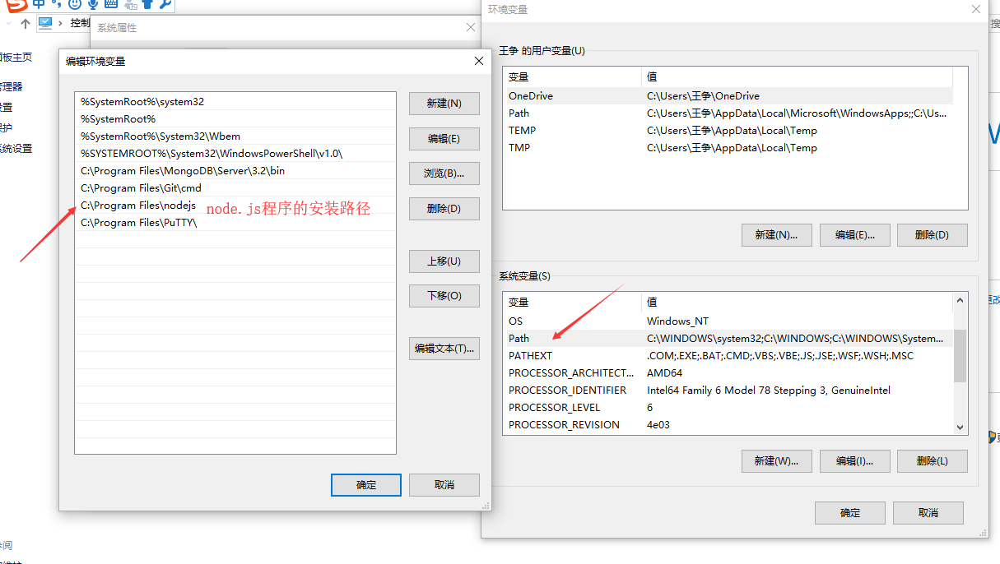

### 安装node包的方式 ？
---
 * 全局安装
   >npm install -g 包名 
 * 本地安装  
   1. 作为项目的依赖安装
   >npm install --save 包名
   2. 作为项目的开发依赖安装
   >npm install --save-dev 包名


###  模块规范

#### ES6 的模块规范

+ 引入模块  

  > import  { Plane }  from './Plane'
  >
  > import Plane from './Plane'    (导入默认模块)

   默认导出与默认导入要配合使用          

+ 导出模块 

  > export  {Plane}
  >
  > export  default  Plane (导出默认模块)

#### CommonJS 规范

 node.js 中的模块规范就是 CommonJS 规范

+ 导入模块

  > let plane = require('./Plane')
  >
  > 如果导入的模块在 node_modules文件夹
  >
  > 下面（在npm服务器安装的模块）
  >
  > 无需写路径，直接写包名就可以了 ,
  >
  > 例如  let webpack  = require('webpack')

+ 导出模块

  > module.exports = Plane

### 全局安装与本地安装的不同点？

---
1. 是否注册环境变量？

  * 全局安装可以注册环境变量
  * 本地安装不可以注册环境变量

2. 安装的位置不同

 * 全局安装是安装在操作系统上面
 * 本地安装安装在了node_modules 文件夹底下

3. package.json 是否发生变化？
 * 全局安装的包 package.json不会发生变化
 * 本地安装的包会改变package.json的  "dependencies"、
 * "devDependencies" 配置

  ```
  /*package.json*/
  {
    "name": "webpack-class",
    "version": "1.0.0",
    "description": "module demo",
    "main": "import.js",
    "scripts": {
        "test": "echo \"Error: no test specified\" && exit 1"
    },
    "author": "",
    "license": "ISC",
    "dependencies": {},
    "devDependencies": {
        "webpack": "^4.10.2"
    }
}
  ```

4. 是否可以通过 require 命令引用模块
 * 全局安装不能通过require命令引用模块

 * 本地装可以通过require命令引用模块

   ####  

   #### 

### 局部安装的两种方式的区别
 * 作为项目的依赖安装
   >npm install --save 包名
 * 作为项目的开发依赖安装
   >npm install --save-dev 包名

  ```   
    `--save` 和 `-- save-dev`     
    --save 作为项目依赖（项目上线的时候也会用到这个包）
    --save-dev 作为项目的开发依赖（项目开发的时候用到这个包，
    项目上线以后就不用这个包了）
  ```

### 模块(包)注册到系统的环境变量当中有什么好处？
---
>在命令行窗口中，
>
>可以在任意文件夹下使用程序提供的命令，
>
>例如我们全局安装了webpack包，
>
>那么在` D:\H5\ES6>` 路径下可以使用
>
> `webpack`命令也可以在
>
> `D:\H5`路径下可以使用 `webpack`命令


### 如何查看安装程序的环境变量？

   
   
   


### 安装本地包的命令

>npm install --save webpack
```
上面命令执行完成后
 1. node_modules 文件夹下回下载 webpack包
 2.package.json 文件 的 dependencies 中会增加 
  "dependencies": {
      "webpack": "^4.10.2"
    }

```
>npm install --save-dev webpack 
```
上面命令执行完成后
 1. node_modules 文件夹下回下载 webpack包
 2.package.json 文件 的 dependencies 中会增加 
  "devDependencies": {
    "webpack": "^4.10.2"
  }

```
>npm install
```
会搜索 package.json所有的依赖包并下载
```
```
node_modules 文件夹里面存放着所有的局部安装的包
（包括开发依赖的包和项目依赖的包）

node_modules 文件夹在安装`第一个包`的时候会自动创建

以后安装的`node包`都会放在node_modules文件夹下
```


​    


