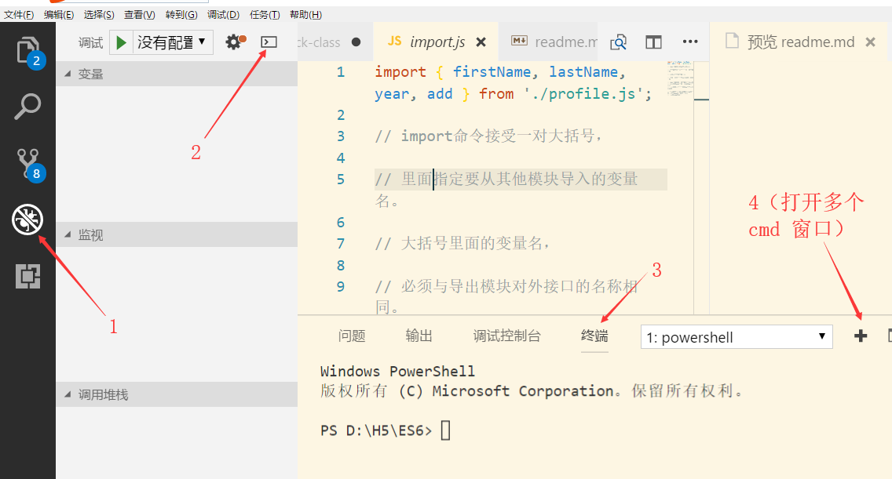

### IDE

> 代码编辑器（sublime、VSCode、webstorm、Hbuidler、Atom）

### cmd窗口？

>windows 操作系统为我们提供的命令行窗口
>我们操作电脑一般用鼠标和键盘
>我们完全可以在 `cmd`窗口操作电脑，在`cmd`窗口操作电脑可以实现和鼠标键盘同样的功能

#### 如何打开计算机的cmd窗口？

 >第一种方式：`windows + R`  在弹出的窗口当中输入 `cmd`命令，
 >
 >然后回车确定（`powershell`窗口本质上就是 `cmd` 窗口）

>第二种方式：通过vscode打开命令行窗口（vscode 里面`集成`了 `cmd` 窗口，vscode可以打开多个 `cmd`  窗口）
打开方式（快捷键是`shift+Ctrl+Y`）如下图：




#### cmd常用命令？

* `cd 空格 文件夹名称`  （进入某个文件夹）
* `ls`  （列出所有文件夹下面的文件）
* `cd  空格 .. ` （跳出某个文件夹）
* `调出上一次命令`  : 上箭头
* `调出下一次命令 `：下箭头
* clear 清空命令行窗口的命令

### node
---

#### 什么是node?

> 和浏览器一样，也是一个ECMAScript 的一个运行平台（软件）
>
> node和浏览器一样，都是安装在操作系统上面的应用软件

#### node 作用？浏览器的作用？

> node : 解析ES5、ES6编写的服务器程序 (服务器程序能够响应客户端的请求)
>
> 浏览器：解析 html、css、js 编写的网页程序 ,  远程拉取服务器上面的网页，并解析，呈现给用户 

#### javascript组成 ? 

> ECMAScirpt、DOM、BOM

#### DOM?BOM?

> DOM(document object model):文档对象模型
> BOM(browser object model):浏览器对象模型

#### 浏览器与node的解析原理？

> 浏览器内置了DOM、BOM , 通过 ES5/ES6 去调用 DOM 、BOM 的api，从而实现网页的动态功能
>
> node内置了许多node包（http包 、file包）等（许多node包还需从npm服务器下载），
>
> 通过 ES5/ES6 去运用这些包，最终能够编写出服务器程序

#### node 和 浏览器的不同点

```
浏览器是解析的网页程序
node解析的是服务器程序
```
#### 脚本语言与编译语言的区别？

---
>   1、脚本语言语法简单，易学
>
>   2、脚本语言必须在某个软件上运行，不能像编译语言那样，可以打包成可执行文件（例如.exe文件）
>
>   3、编程语言的发展历史？
>
>   ​    汇编语言-->编译语言-->脚本语言
>
>   4、编程语言的发展趋势？
>
>   ​      是越来越简单易学，也就是脚本化
>
>   5、编译语言的执行速度要快于脚本语言
>
>   6、一般底层的程序都是用编译语言实现的
>
>   ​     （
>
>   ​         windows操作系统 是用 c \ c++ 编写的，
>
>   ​         我们安装在windows操作系统上面的绝
>
>   ​         大部分应用程序都是用 c++编写的
>
>   ​      ）
>
>   7、常见的编译语言：c 、c++、java
>
>   ​     常见的脚本语言： javascript、php、python、ruby
>
>   ​     苹果手机的ios操作系统是用什么语言编写的？
>
>   ​      底层是用c、 c++ ;上层用 object-c 、swift
>
>   ​     普通手机的android操作系统是用什么语言编写的？
>
>   ​     java
>
>   8、跨平台app?
>
>   ​    ios程序员开发ios系统上面的 app
>
>   ​    android程序员开发的是 android 系统上面的app
>
>   ​    任何一款原生app都会有两套代码，
>
>   ​    一套代码是用 objective-c 编写的 ，运行在ios操作系统上
>
>   ​    一套代码是用 java  编写的，运行在 android操作系统上
>
>      我们可以利用 html、css、js 等技术编写和app一样的功能，
>
>      然后打包成app，安装在  ios 和 android 操作系统上，这种app
>
>      我们管它叫做 hybird app (与之对应的是native app)

>    native app:  用原生语言（objective-c 、java）编写

>    hybird app: 用 html、css、javascript编写
>
>   facebook 在 2015年的时候推出了一个开发hybird app的js框架 : react native

> 随着手机硬件的不断升级，
>
> hybird app的用户体验和 native app已经没有差别了

#### 计算机语言按开发方式分类？

> 面向过程的语言和面向对象的的语言
>
> 面向过程的语言： c语言 （单片机等一些列相关的硬件，在c当中有二进制运算）
>
> 面向对象的语言：c++、java、javascript、php、python、ruby

### node 安装？
>官网下载安装
>
>node安装完成后会自动将程序注册到系统的环境变量当中，
>
>因而，我们可以在cmd窗口任意文件夹下面使用node命令
>
>
>
>如果node程序没有注册到系统的环境变量当中，那么node程序
>
>中的命令如何使用？
>
>命令前面要加上node程序的安装路径
