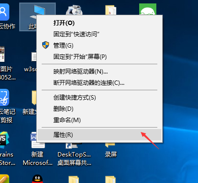

### 安装node包的方式 ？
---
 * 全局安装
   >npm install -g 包名 
 * 本地安装  
   1. 作为项目的依赖安装
   >npm install --save 包名
   2. 作为项目的开发依赖安装
   >npm install --save-dev 包名


### 全局安装与本地安装的不同点？
---
1. 是否注册环境变量？

 * 全局安装可以注册环境变量
 * 本地安装不可以注册环境变量

2. 安装的位置不同

 * 全局安装是安装在操作系统上面
 * 本地安装安装在了node_modules 文件夹底下
 
3. package.json 是否发生变化？
 *全局安装的包package.json不会发生变化
 *本地安装的包会改变package.json的内容
  改变package.json的  "dependencies"、
  "devDependencies"

  ```
  /*package.json*/
  {
    "name": "webpack-class",
    "version": "1.0.0",
    "description": "module demo",
    "main": "import.js",
    "scripts": {
        "test": "echo \"Error: no test specified\" && exit 1"
    },
    "author": "",
    "license": "ISC",
    "dependencies": {},
    "devDependencies": {
        "webpack": "^4.10.2"
    }
}

  ```

4. 是否可以通过 require 命令应用模块
 * 全局安装不能通过require命令引用模块
 * 本地装可以通过require命令引用模块
#### 局部安装的特点

 * 没有注册到系统的环境变量当中
 * 没有安装在 windows\linux等  操作系统上    
 * 安装在了项目的 node_modules 文件夹下面  
 * 局部安装一定要在项目的`根目录`下安装
   例如 ` D:\H5\ES6\Module\webpack-class>`


### 全局安装

   >`全局安装`的特点？

    >会将包注册到系统的环境变量当中
    >安装在windows系统上面了

   >注册到系统的环境变量当中有什么好处？  
```javascript
    cmd窗口能够识别包内的命令（可以在任意地方使用包内的命令，无需关心使用命令的路径）

    例如 `node`
    node注册到了系统环境变量当中，可以在`任意地方`调用`node`命令  
    >在` D:\H5\ES6>`文件夹下
    >`node -v `  查看node的版本号 
    >在 `D:\H5`文件加下   
    >`node -v `  查看node的版本号 
```
   >如果node没有注册到系统的环境变量当中怎么查看版本号？
 ```javascript
    `C:\Program Files\nodejs\node -v`（ 使用node命令的时候要加上node的安装路径）
```


  >为什么 `node *** ` 会被 `cmd` 窗口识别？

   >因为node 在安装的时候注册到了系统的环境变量当中
```javascript
   如何查看系统的环境变量？
```
   
   
   

### 局部安装
 * 作为项目的依赖安装
   >npm install --save 包名
 * 作为项目的开发依赖安装
   >npm install --save-dev 包名

     
    >`--save` 和 `-- save-dev`     
    >--save 作为项目依赖（项目上线的时候也会用到这个包）
    --save-dev 作为项目的开发依赖（项目开发的时候用到这个包，项目上线以后就不用这个包了）

### npm init    
---
初始化项目,生成整个项目的依赖包配置文件 package.json

### npm install 
---
安装包的命令

>npm install --save webpack
```
上面命令执行完成后
 1. node_modules 文件夹下回下载 webpack包
 2.package.json 文件 的 dependencies 中会增加 
  "dependencies": {
      "webpack": "^4.10.2"
    }

```
>npm install --save-dev webpack 
```
上面命令执行完成后
 1. node_modules 文件夹下回下载 webpack包
 2.package.json 文件 的 dependencies 中会增加 
  "devDependencies": {
    "webpack": "^4.10.2"
  }

```
>npm install
```
会搜索 package.json所有的依赖包并下载
```

>将webpack作为项目依赖下载到 node_modules 文件夹
>node_modules 文件夹里面存放着所有的局部安装的包（包括开发依赖的包和项目依赖的包）
>node_modules 文件夹在安装`第一个包`的时候会自动创建
>以后安装的`局部包`都会放在node_modules文件夹下

### npm list
---
>查看所有依赖的包    

    


